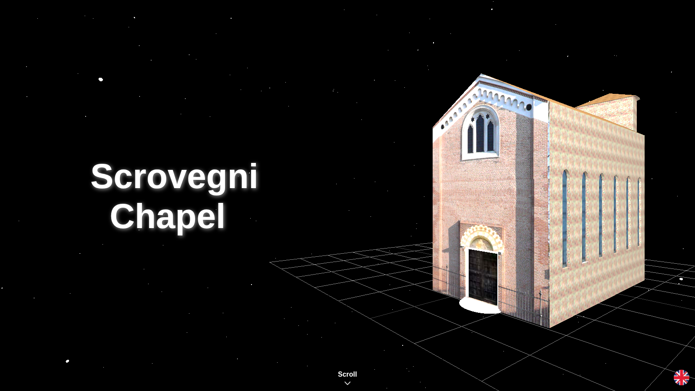
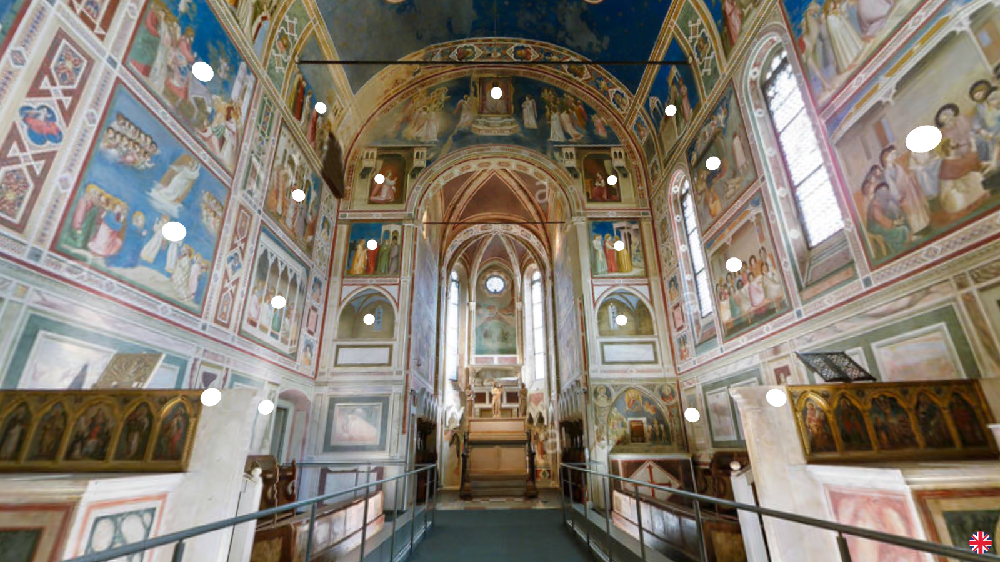
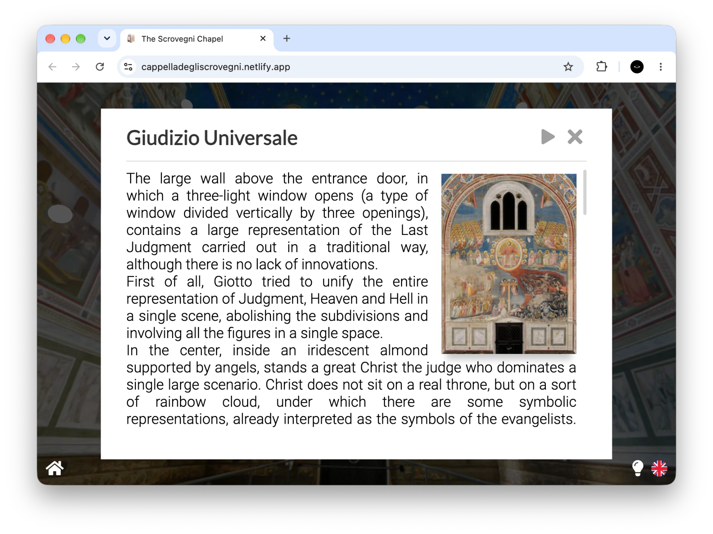
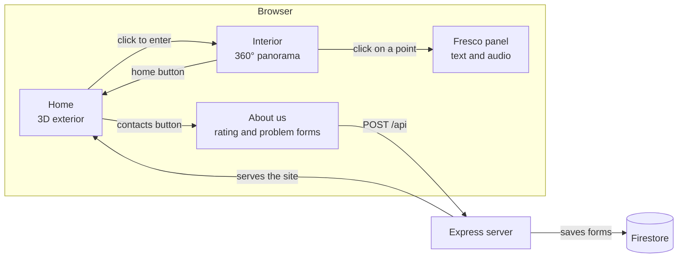

# Scrovegni Chapel 360° Virtual Tour

A bilingual 3D tour of the Scrovegni Chapel in Padua: anyone can explore the interior from the browser and open a description and an audio guide for each of 58 frescoes.

[](LICENSE)

[](#recognition)



**Live demo:** https://cappelladegliscrovegni.netlify.app/

<!-- portfolio:summary
## The problem
My art history teacher wanted a website that rebuilds the Scrovegni Chapel in 3D, with descriptions and audio guides of the frescoes made by the class. I built the site with my classmate [@IvanLomaka](https://github.com/IvanLomaka), and together we designed and coded all of it, from the 3D scenes to the interface and the server.

## The solution
A three.js site that opens on a 3D model of the exterior and then moves into a 360° view of the interior, with 58 clickable points. Each point opens a description and an audio guide, in Italian or English, written and recorded by the class.

## Technical challenges
- I drove the home camera with the scroll wheel, moving it between fixed viewpoints with an ease-in-out curve.
- I turned a cubemap into a 360° interior and made 58 points in 3D space clickable.
- I handed control from the WebGL canvas to an HTML panel and back.

## What I learned
- The basics of three.js: scenes, cameras, renderers, models, cubemaps.
- How to mix a 3D canvas with ordinary HTML interfaces.
- My first server: Express, validation and a database behind a page.

## Stack
JavaScript, HTML, CSS, three.js, Tween.js, Node.js, Express, Joi, Firebase (Firestore, Analytics), Heroku, Netlify

## Recognition
- First place, as lead developer, in the "To Digital Competence 4.0" contest by USR Veneto and AICA, 2023 ([school news](https://liceoduca.edu.it/2023/12/03/concorso-to-digital-competence-4-0/)).
-->

<!-- portfolio:start -->
## The problem
My art history teacher, Prof. Cristina Tranchese, had seen a website that rebuilt the Scrovegni Chapel in 3D. She wanted one made by my school. She gave the job of building the site to me and [@IvanLomaka](https://github.com/ivanlomaka). The rest of the class, 3BA at Liceo Duca degli Abruzzi in Treviso, would write the descriptions of the frescoes and record them as audio, in Italian and in English.

I was a beginner. I had just finished a [chess game](https://github.com/tommasomoro8/chess) and had never used three.js or worked in 3D. At the time, it was no small challenge.

## The solution
Instead of letting it discourage me, I took it as a chance to improve and broaden my skills. I started from the basics of three.js, and in a few months I grew a lot as a programmer, enough to see the project through to the end.

The site opens on a 3D model of the chapel's exterior, floating in a field of stars. Each scroll step moves the camera to a new viewpoint and shows a new line of text. On the last one, a click takes you inside.

The interior is a 360° panorama. You drag to look around. White dots mark 58 frescoes and details. Clicking a dot flies the camera towards it and opens a panel with an image of the work, a description and a play button for the audio guide.





The flag button switches between Italian and English: descriptions, audio and interface change. The home page also has an "About us" window with the credits, a form to rate the site from 1 to 5 and a form to report a problem.

## Technical challenges
- **Scroll-driven camera.** The home page keeps the scroll position fixed in the middle of a tall page and only reads its direction. Each step moves the camera between keyframes stored in `data.js`, over 2 seconds, in `requestAnimationFrame`, with an ease-in-out curve.
- **From outside to inside.** The exterior and the interior are two separate three.js scenes with two renderers. To hide the switch, I widen the field of view, fade in a black overlay, swap the scenes and narrow the field of view again. Each render loop stops while its scene is hidden, so the GPU doesn't waste work drawing a scene nobody sees.
- **Clickable points in a panorama.** The interior is a cubemap set as the scene background, with OrbitControls fixed at the centre, zoom off and rotation inverted so dragging feels like turning your head. Three.js meshes don't receive DOM events, so I used THREEx.DomEvents to get `click`, `mouseover` and `touchstart` on the 58 spheres. A Tween.js animation moves the camera, then the HTML panel opens on top and the controls stay disabled until it closes.
- **A first server.** The two forms post JSON to Express. Joi validates it (vote from 1 to 5, valid e-mail) before `firebase-admin` writes it to Firestore. The service account comes from environment variables.

## What I learned
- The basics of three.js: scenes, cameras, renderers, lights, loading a COLLADA model and animating the camera by hand.
- How to build a 360° environment from a cubemap and place interactive points in 3D space.
- How to mix three.js and the DOM: pause the 3D controls, open an HTML panel, then hand control back to the canvas.
- My first step away from a page made only of client-side HTML, CSS and JavaScript: an Express server with validation and a database.

## Stack
- **Client:** JavaScript, HTML, CSS, three.js (with OrbitControls and ColladaLoader), Tween.js, THREEx.DomEvents
- **Server:** Node.js, Express, Joi, Helmet, firebase-admin
- **Services:** Firebase (Firestore, Analytics)
- **Hosting:** Heroku (original deploy), Netlify (current demo)

## Recognition
- First place, as lead developer, in the "To Digital Competence 4.0" contest, organised by USR Veneto (Ufficio Scolastico Regionale per il Veneto) and AICA (Associazione Italiana per l'Informatica ed il Calcolo Automatico):
  - [Official document, USR Veneto](https://istruzioneveneto.gov.it/wp-content/uploads/2023/06/m_pi.AOODRVE.REGISTRO-UFFICIALEU.0015352.09-06-2023.pdf) (9 June 2023)
  - ["Il digitale oggi", JobOrienta](https://www.joborienta.net/site/it/ev/2023/11/24/il-digitale-oggi/) (24 November 2023)
  - [School news, Liceo Duca degli Abruzzi](https://liceoduca.edu.it/2023/12/03/concorso-to-digital-competence-4-0/) (3 December 2023)
<!-- portfolio:end -->

## Architecture



- **No build step.** `index.html` loads every script with a plain `<script>` tag, and the scripts share global variables. The order matters: `data.js` comes first, then `form.js`, `home.js`, `app.js` and `render.js`. three.js and its add-ons are copied into `src/public/libraries/`.
- **Content in one file.** `data.js` holds the home keyframes and, for each of the 58 points, its position, the camera target, title, subtitle and the Italian and English texts. Media files are named by index: `img/N.png`, `audio/N.m4a` (Italian) and `audio/NEN.m4a` (English). Adding a point means one entry and three files.
- **Two renderers.** The home and the interior each have their own scene, camera and renderer. Only the visible one runs its loop.
- **A thin server.** Express serves `src/public` as static files and exposes two endpoints. Every other URL redirects to `/`. The client folder also works on its own as a static site, without the forms.

## Running locally

You need Node.js (I tested it with Node 22) and a Firebase project with Firestore. `src/database/database.js` reads the service account at startup, so the server doesn't start without it.

```bash
git clone https://github.com/tommasomoro8/cappella-degli-scrovegni.git
cd cappella-degli-scrovegni
npm install
cp .env.example .env    # fill in the values from your service account key
npm start               # http://localhost:3000
```

`.env` is read only when `NODE_ENV` isn't `production`. With `NODE_ENV=production` the server redirects every request to HTTPS.

To look at the site without the server (the forms won't work), serve the client folder as static files:

```bash
python3 -m http.server 8000 --directory src/public    # http://localhost:8000
```

There are no automated tests.

## Repository structure
```
cappella-degli-scrovegni/
├── src/
│   ├── app.js               ← Express entry point
│   ├── routes/              ← static files and the /api endpoints
│   ├── middleware/          ← HTTPS redirect and fallback to /
│   ├── database/            ← Firestore writes with firebase-admin
│   └── public/              ← the site served to the browser
│       ├── index.html
│       ├── home.js          ← home scene and scroll-driven camera
│       ├── render.js        ← interior scene and clickable points
│       ├── app.js           ← fresco panel, audio, language, light/dark mode
│       ├── form.js          ← About us window and API calls
│       ├── data.js          ← keyframes, 58 points, texts in IT and EN
│       ├── analytics.js     ← Firebase Analytics
│       ├── base.css
│       ├── libraries/       ← three.js, OrbitControls, ColladaLoader, Tween.js, THREEx.DomEvents
│       ├── render.dae       ← 3D model of the exterior
│       ├── render/          ← textures of the model
│       ├── cubemap/         ← six faces of the interior panorama
│       ├── img/             ← one image per point
│       ├── audio/           ← audio guides, Italian and English
│       └── system/          ← logo, flags and interface icons
├── docs/screenshots/        ← images used in this README
├── .env.example             ← Firebase variables with placeholder values
├── Procfile                 ← start command for Heroku
├── package.json
├── README.md
├── LICENSE
└── portfolio.yml            ← metadata for my portfolio
```

## Known limitations and future work

**Limitations**
- The demo is served as a static page, so the rating and problem forms don't work there.
- The server doesn't start without the Firebase variables: `database.js` crashes when it reads `PRIVATE_KEY`.
- When Firestore rejects a write, `routes/api.js` sends the whole error object to the browser.
- The page title stays "Loading..." if even one of the 64 preloaded images fails to load.
- The audio files take 156 MB of the repository's 175 MB.

**Future work**
- **Replace the floating intro.** I no longer like the exterior floating in space, visually or for usability: it isn't always clear that you have to scroll and then click. I would drop the scroll hijacking and open on the exterior with one visible "Enter" button that flies the camera through the door.
- **Treat the server as a real part of the project, or remove it.** Collecting feedback and visits was a good idea, but I handled it lightly, and it no longer works on the demo. I would move the two endpoints into Netlify Functions next to the demo, so the forms work again on the same host. I would also return a generic error message, add rate limiting, and let the static site run without Firebase.
- **Move the content out of the code.** I would turn `data.js` into one JSON file per language, loaded at runtime. The class could then fix a text without touching JavaScript.
- **Lighter audio.** I would re-encode the speech recordings at a lower bitrate to cut the download size.

## Credits and license
- **Tommaso Moro and Ivan Lomaka:** design and code of the whole site (3D scenes, interface, server).
- **Class 3BA 2021/22, Liceo Duca degli Abruzzi (Treviso):** descriptions of the frescoes.
- **Ginevra Taddei and Greta Beraldo:** audio recordings in Italian and English.
- **Andrea Luca Bristot (3AA):** refined the 3D model of the chapel's exterior.
- **Prof. Cristina Tranchese:** art history teacher, she proposed the project and supervised it.
- Libraries: [three.js](https://threejs.org/) with OrbitControls and ColladaLoader, [Tween.js](https://github.com/tweenjs/tween.js), [THREEx.DomEvents](https://github.com/jeromeetienne/threex.domevents), [Express](https://expressjs.com/), [Joi](https://joi.dev/), [Helmet](https://helmetjs.github.io/), [Firebase](https://firebase.google.com/).
- Icons: [Font Awesome](https://fontawesome.com/). Fonts: [Lato](https://fonts.google.com/specimen/Lato), [Sora](https://fonts.google.com/specimen/Sora), [Lobster](https://fonts.google.com/specimen/Lobster) and [Roboto](https://fonts.google.com/specimen/Roboto) from Google Fonts.

The code is released under the [MIT License](LICENSE). The audio recordings in `src/public/audio/` are excluded: they belong to the people who recorded them.

---

Created by Tommaso Moro and Ivan Lomaka in March 2022.
